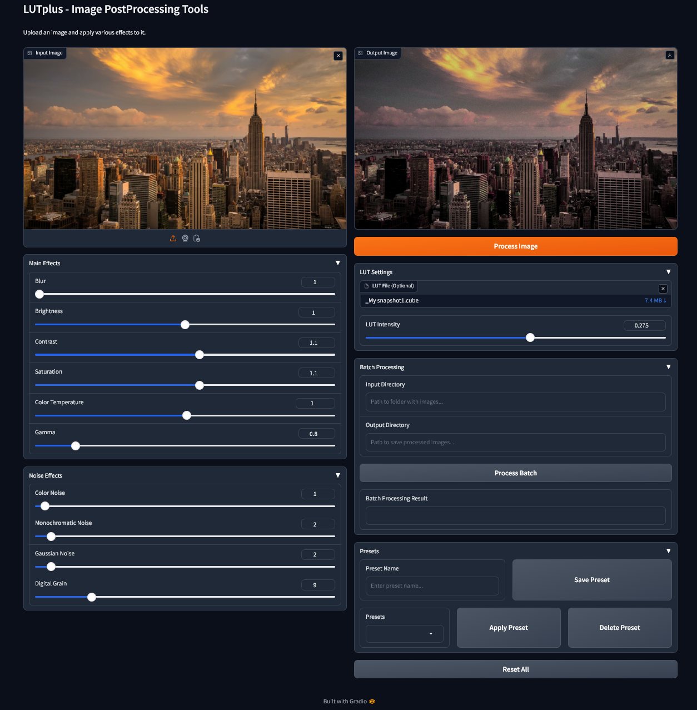

# LUTplus - Image PostProcessing Tools

A powerful and user-friendly image post-processing tool built with Python and Gradio. LUTplus offers a wide range of image adjustment capabilities, including LUT (Look-Up Table) application, various noise effects, and basic image adjustments.



## Python Compatibility

**Important: Python Version Requirements**

LUTplus is compatible with:
- Python 3.9.x
- Python 3.10.x
- Python 3.11.x
- Python 3.12.x

**NOT Compatible with Python 3.13+**
Python 3.13 and newer versions are NOT supported because the required NumPy 1.x packages are not available for Python 3.13+. If you have Python 3.13 installed, please install an earlier version (recommended: Python 3.12.x) to use LUTplus.

**Note for Python 3.13+ Users:**
You don't need to uninstall your existing Python 3.13+ installation. Windows and most Linux distributions support multiple Python versions installed side-by-side. Simply install Python 3.12.9 (or any 3.12.x version) alongside your existing installation, and use it specifically for LUTplus. Your other applications can continue using Python 3.13+.

For best results, we recommend using Python 3.12.x for maximum compatibility and performance.

## Features

- **Main Effects:**
  - Brightness adjustment
  - Contrast control
  - Saturation adjustment
  - Color temperature
  - Gamma correction
  - Gaussian blur

- **Noise Effects:**
  - Color noise
  - Monochromatic noise
  - Gaussian noise
  - Digital grain

- **LUT Support:**
  - Support for .cube and .3dl LUT files
  - Adjustable LUT intensity
  - Professional-grade color grading

- **Batch Processing:**
  - Process multiple images at once
  - Preserve original file names
  - Support for various image formats

- **Preset System:**
  - Save custom settings
  - Load saved presets
  - Quick reset to defaults

- **GPU Acceleration (Optional):**
  - NVIDIA GPU support via CuPy
  - Significantly faster processing for large images and batch operations
  - Automatic fallback to CPU if GPU is unavailable
  - Supports CUDA 11.x and 12.x

## Installation

1. Clone the repository:
```bash
git clone https://github.com/yourusername/LUTplus.git
cd LUTplus
```

2. Create a virtual environment:
```bash
python -m venv venv
```

3. Activate the virtual environment:
- Windows:
```bash
venv\Scripts\activate
```
- Linux/Mac:
```bash
source venv/bin/activate
```

4. Install dependencies:
```bash
pip install -r requirements.txt
```

## Usage

1. Start the application using one of the following methods:

**Windows Users:**
- Use `run.bat` for local mode (accessible only on your computer)
- Use `run_network.bat` for network mode (accessible from other devices in your local network)
- Use `run_gpu.bat` for GPU-accelerated mode (requires NVIDIA GPU with CUDA support)

The difference:
- `run.bat`: Starts the application on localhost (127.0.0.1), making it accessible only from the computer it's running on
- `run_network.bat`: Starts the application in network mode, making it accessible from other devices in your local network via your computer's IP address
- `run_gpu.bat`: Starts the application with GPU acceleration enabled. Automatically installs CuPy (tries CUDA 12.x first, then CUDA 11.x). Falls back to CPU mode if GPU is unavailable

**Manual Start:**
```bash
python app.py           # For local mode
python app.py --network # For network mode
python app.py --gpu     # For GPU-accelerated mode
python app.py --gpu --network  # For GPU-accelerated network mode
```

2. Open your web browser and navigate to:
```
http://127.0.0.1:7860      # For local mode
http://[your-ip-address]:7860  # For network mode
```

3. Use the interface to:
- Upload an image
- Adjust various effects using sliders
- Apply LUT files
- Process images individually or in batch
- Save and load presets

## Supported Formats

- **Input Images:** JPG, JPEG, PNG, BMP, TIFF
- **LUT Files:** .cube, .3dl

## Requirements

- Python 3.9+ (3.12.x recommended)
- OpenCV
- NumPy
- Gradio
- Pillow

**Optional (for GPU acceleration):**
- CuPy (cupy-cuda12x or cupy-cuda11x)
- NVIDIA GPU with CUDA support

See `requirements.txt` for complete list of dependencies.

**Note:** GPU acceleration is optional. The application will work perfectly fine on CPU-only systems. GPU acceleration provides significant performance improvements, especially for:
- Large resolution images
- Batch processing multiple images
- Complex LUT operations
- Multiple noise effects applied simultaneously

## Project Structure

```
LUTplus/
├── app.py              # Main application file
├── requirements.txt    # Project dependencies
├── run.bat             # Windows launcher (CPU mode)
├── run_network.bat      # Windows launcher (network mode)
├── run_gpu.bat          # Windows launcher (GPU mode)
├── presets.json         # Saved presets (created on first use)
├── screenshots/         # Application screenshots
└── README.md           # Project documentation
```

## Contributing

1. Fork the repository
2. Create your feature branch (`git checkout -b feature/AmazingFeature`)
3. Commit your changes (`git commit -m 'Add some AmazingFeature'`)
4. Push to the branch (`git push origin feature/AmazingFeature`)
5. Open a Pull Request

## License

This project is licensed under the MIT License - see the [LICENSE](LICENSE) file for details.

## Acknowledgments

- OpenCV team for image processing capabilities
- Gradio team for the web interface framework
- All contributors and users of LUTplus

## GPU Acceleration

LUTplus now supports GPU acceleration through CuPy, which can significantly speed up image processing operations. 

### Requirements for GPU Mode:
- NVIDIA GPU with CUDA support
- CUDA 11.x or 12.x installed
- CuPy library (automatically installed by `run_gpu.bat`)

### Performance Benefits:
GPU acceleration is most beneficial for:
- **Large images** (4K and above)
- **Batch processing** (processing multiple images)
- **Complex LUT operations** (3D LUT interpolation)
- **Multiple effects** applied simultaneously

### How to Use:
1. Ensure you have an NVIDIA GPU with CUDA installed
2. Run `run_gpu.bat` instead of `run.bat`
3. The application will automatically detect and use your GPU
4. If GPU is unavailable, it will automatically fall back to CPU mode

### Troubleshooting:
- If CuPy installation fails, make sure you have the correct CUDA version installed
- Check your GPU compatibility: CuPy requires CUDA 11.0+ or 12.0+
- If you see "GPU support disabled" message, the application will still work in CPU mode

## Future Plans

- WebUI Forge extension version
- Automatic1111 extension version
- Additional image processing features
- Performance optimizations

## Contact

Project Link: [https://github.com/thejohnd0e/LUTplus](https://github.com/thejohnd0e/LUTplus) 
